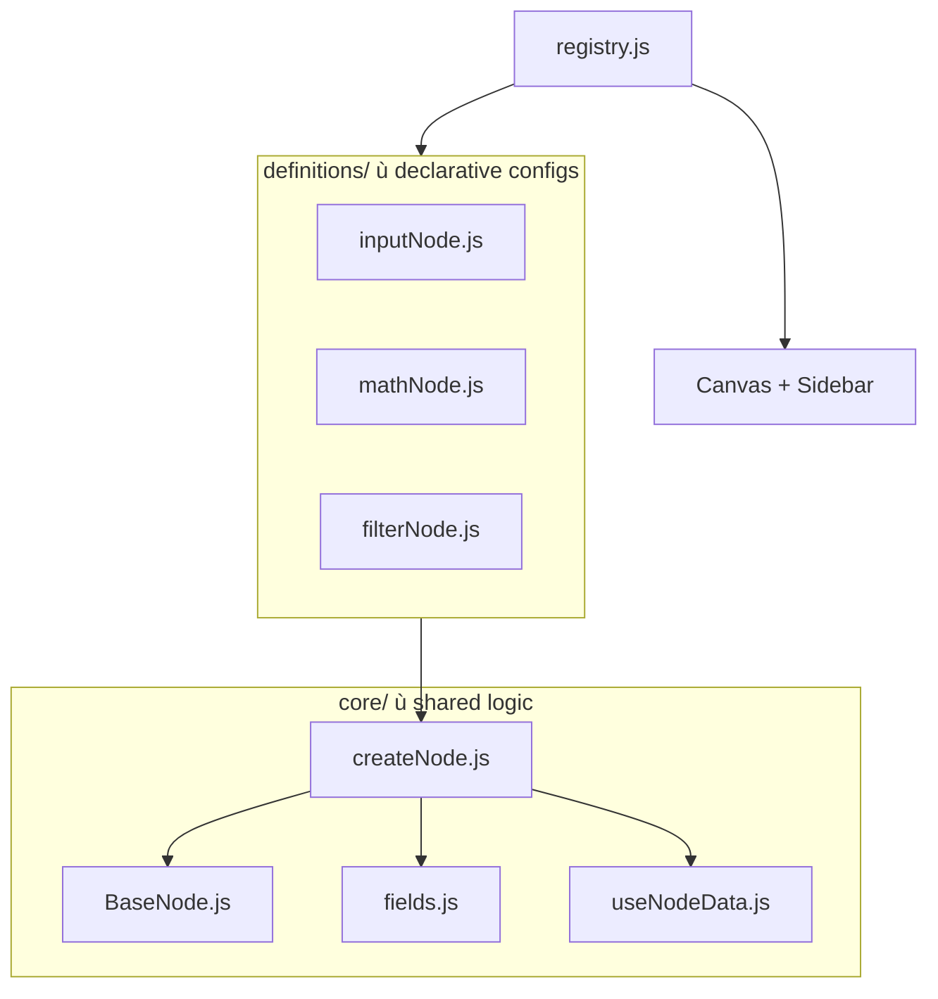
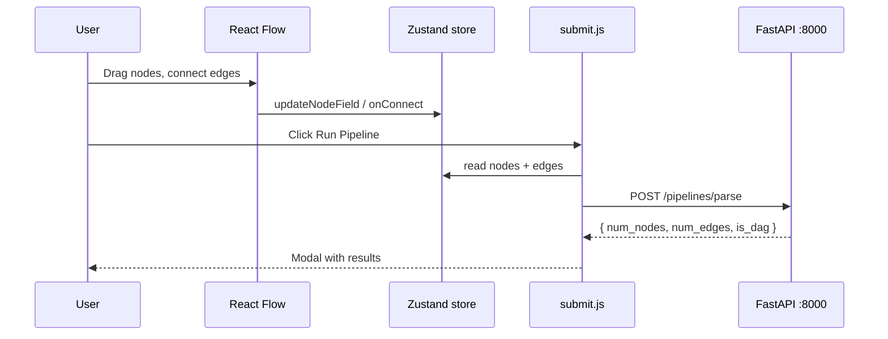

# Implementation Guide

Brief walkthrough of all four assessment parts for the VectorShift-inspired pipeline editor.

| Part | Topic | Key files |
|------|-------|-----------|
| 1 | Node abstraction | `nodes/core/createNode.js`, `nodes/registry.js` |
| 2 | Styling | `nodeStyles.js`, `App.js`, `BaseNode.js` |
| 3 | Text node logic | `textNode.js`, `textParsing.js` |
| 4 | Backend integration | `submit.js`, `backend/main.py` |

---

## App overview


The editor has three regions:

- **Header** ù branding + **Run Pipeline** (Part 4)
- **Sidebar** ù searchable, categorized node palette (Part 1 + 2)
- **Canvas** ù React Flow graph with minimap, zoom, snap-to-grid (Part 2)

---

## Project structure

```
frontend_technical_assessment/
??? backend/
?   ??? main.py                 # FastAPI ù DAG check (Part 4)
??? frontend/src/
?   ??? App.js                  # Layout + Ant Design theme (Part 2)
?   ??? ui.js                   # React Flow canvas
?   ??? toolbar.js              # Sidebar palette
?   ??? store.js                # Zustand graph state
?   ??? submit.js               # POST pipeline (Part 4)
?   ??? nodes/
?       ??? core/               ? shared abstraction (Part 1)
?       ?   ??? createNode.js   ? factory
?       ?   ??? BaseNode.js     ? visual shell + handles
?       ?   ??? fields.js       ? reusable inputs
?       ?   ??? useNodeData.js  ? state bridge
?       ?   ??? nodeStyles.js   ? design tokens (Part 2)
?       ?   ??? textParsing.js  ? variable parser (Part 3)
?       ?   ??? icons.js
?       ??? definitions/        ? one file per node (Part 1)
?       ?   ??? inputNode.js    ? original 4, refactored
?       ?   ??? outputNode.js
?       ?   ??? llmNode.js
?       ?   ??? textNode.js     ? Part 3 enhancements
?       ?   ??? mathNode.js     ? 5 new demo nodes
?       ?   ??? filterNode.js
?       ?   ??? apiNode.js
?       ?   ??? imageNode.js
?       ?   ??? timerNode.js
?       ??? registry.js         ? wires canvas + sidebar
??? docs/
    ??? images/                 ? diagrams used in this doc
```

---

## Part 1 ù Node Abstraction

### Problem

The starter project had four node files (Input, Output, LLM, Text) with duplicated header markup, Handle wiring, and form logic. Copy-pasting to add a fifth node would repeat most of that code.

### Solution

A **factory + registry** pattern: each node is a small config object; shared behavior lives in `core/`.




### How `createNode` works

Pass a config object, get a React Flow component:

```js
createNode({
  kind: 'transform',
  title: 'Math',
  icon: NODE_ICONS.math,
  subtitle: ({ data }) => `a ${data.op} b`,   // dynamic
  handles: ({ id }) => [ /* Handle defs */ ],
  fields: [ { name: 'op', type: 'select', options: [...] } ],
  defaults: { op: 'add' },
  render: (ctx) => <CustomBody />,            // optional escape hatch
});
```

| Config key | Purpose |
|------------|---------|
| `kind` | Accent color via `nodeStyles.js` |
| `handles` | Static array **or** function of `{ id, data }` |
| `fields` | Static array **or** function ù conditional UI |
| `width` | Static number **or** function ù auto-resize |
| `render` | Full custom body when fields aren't enough |

### Five new demo nodes

| Node | File | What it showcases |
|------|------|-------------------|
| **Math** | `mathNode.js` | Multiple handles, dynamic subtitle |
| **Filter** | `filterNode.js` | `fields` as function ù regex mode adds Flags field |
| **API Call** | `apiNode.js` | Custom width, textarea, 4 handles |
| **Image** | `imageNode.js` | `render` escape hatch + live preview |
| **Delay** | `timerNode.js` | Number + select fields |

Adding a node = **one definition file + one registry entry**. No changes to `ui.js` or `toolbar.js`.

---

## Part 2 ù Styling

### Approach

VectorShift-inspired design using **Ant Design** + centralized design tokens. No CSS framework beyond Ant's theme API and inline token usage.

### Key design decisions

| Element | Implementation |
|---------|----------------|
| Color system | `NODE_TOKENS` + `KIND_ACCENTS` in `nodeStyles.js` |
| Layout | Ant `Layout` ù dark sidebar, light canvas (`App.js`) |
| Nodes | `BaseNode.js` ù accent stripe, icon badge, hover/selected shadows |
| Palette | `draggableNode.js` ù dark cards with kind-colored left stripe |
| Canvas | Dot grid, smooth-step animated edges, color-coded minimap (`ui.js`) |
| Forms | Ant inputs wrapped in `fields.js` with `nodrag` for in-node editing |

### Kind ? accent colors

```
input       #3B82F6  blue
output      #10B981  green
llm         #8B5CF6  purple
text        #F59E0B  amber
transform   #06B6D4  cyan    (Math, Filter)
integration #EF4444  red     (API)
media       #EC4899  pink    (Image)
control     #6B7280  gray    (Delay)
```

To re-skin the entire editor, edit **`nodeStyles.js`** and the Ant theme in **`App.js`**.

---

## Part 3 ù Text Node Logic


### Requirement 1 ù Auto-resize

| Dimension | How |
|-----------|-----|
| **Width** | `measureLongestLineWidth()` in `textParsing.js` uses an off-screen canvas to measure the widest line; node width = measured + padding, clamped 240ù480px |
| **Height** | Ant `TextArea` with `autoSize={{ minRows: 2, maxRows: 14 }}` + `minHeight` scaled by variable count so handles don't overlap |

### Requirement 2 ù `{{ variable }}` handles

```
User types:  Hello {{ name }}, score: {{ score }}
                              ?
parseVariables()  ?  ['name', 'score']
                              ?
handles({ id, data })  ?  target handles on left, one per variable
                              ?
syncHandles() in store  ?  removes edges when variables are deleted/renamed
```

- Regex: `/\{\{\s*([A-Za-z_$][A-Za-z0-9_$]*)\s*\}\}/g`
- Handle IDs: `<nodeId>-var-<name>` ù stable while the name exists
- Wired through the **generic** `createNode` pattern ù no special cases in the factory

---

## Part 4 ù Backend Integration


### Frontend ù `submit.js`

1. Read `nodes` and `edges` from Zustand store
2. `POST http://localhost:8000/pipelines/parse` with JSON body
3. Show **Ant Design Modal** with results (assessment asked for an alert ù modal is used for a cleaner UX)
4. Error toast if backend is unreachable

### Backend ù `main.py`

`POST /pipelines/parse` accepts `{ nodes, edges }` and returns:

```json
{
  "num_nodes": 3,
  "num_edges": 2,
  "is_dag": true
}
```

DAG detection uses **Kahn's algorithm** (topological sort) ù O(V + E), handles cycles and self-loops.

### Demo scenarios

| Pipeline | Expected result |
|----------|-----------------|
| Input ? Text ? Output | `is_dag: true` |
| Node A ? B ? A (cycle) | `is_dag: false` |

---

## Data flow (end to end)



---

## Run locally

```bash
# Terminal 1 ù backend (port 8000)
cd backend
pip install -r requirements.txt
python -m uvicorn main:app --port 8000

# Terminal 2 ù frontend (port 3000)
cd frontend
npm install
npm start
```

Open [http://localhost:3000](http://localhost:3000), build a pipeline, click **Run Pipeline**.

---

## Recording demo checklist

- [ ] Drag nodes from categorized sidebar (Part 1 + 2)
- [ ] Show Math / Filter / Image nodes ù different config patterns (Part 1)
- [ ] Text node: type `{{ vars }}`, watch handles + resize (Part 3)
- [ ] Run Pipeline ù valid DAG (Part 4)
- [ ] Create a cycle ù `is_dag: false` (Part 4)
- [ ] Brief code peek: `createNode.js`, `registry.js`, `textParsing.js`, `submit.js`

---

## Screenshots (optional)

Add your screen-recording captures to `docs/images/` for richer docs:

| Filename | Content |
|----------|---------|
| `demo-pipeline.png` | Full editor with a sample pipeline |
| `demo-text-node.png` | Text node with multiple `{{ variables }}` |
| `demo-dag-modal.png` | Run Pipeline result modal |
| `demo-cycle.png` | Cycle detected ù red DAG tag |

Reference in markdown: ``
